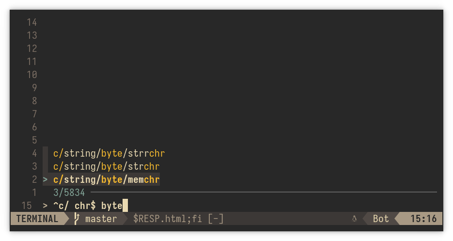

cppdoc.nvim
===========

Allows you to quickly search through a local copy of `cppreference`_
documentation with `fzf`_ fuzzy finder, and open it in your web browser.

The html files are automatically fetched and indexed from
`cppreference-doc`_ GitHub repository. The archive weights about 5MiB.

.. _cppreference: https://en.cppreference.com/w/
.. _cppreference-doc: https://github.com/PeterFeicht/cppreference-doc
.. _fzf: https://github.com/junegunn/fzf

Configuration
-------------

With `packer.nvim`_:

.. code-block:: lua

    use {
        "Xertes0/cppdoc.nvim",
        config = function()
            require("cppdoc").setup()
        end
    }

Then you can map a key to use it:

.. code-block:: lua

    vim.keymap.set("n", "<leader>dc", ":lua require('cppdoc').open()<CR>")

.. _packer.nvim: https://github.com/wbthomason/packer.nvim

